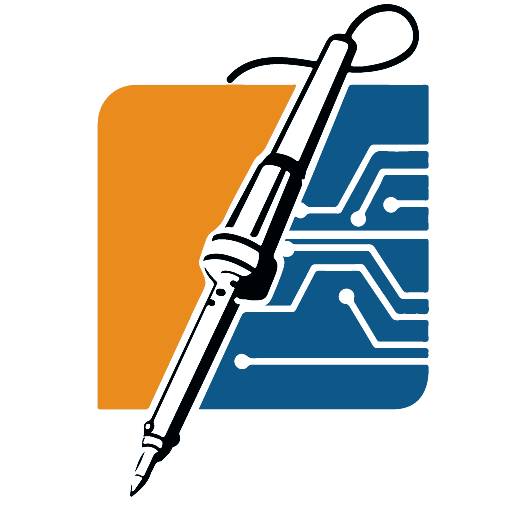
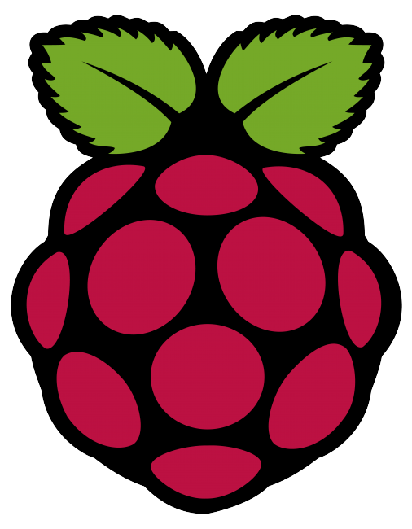
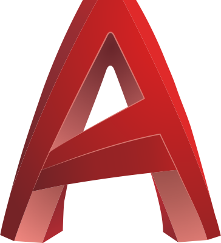
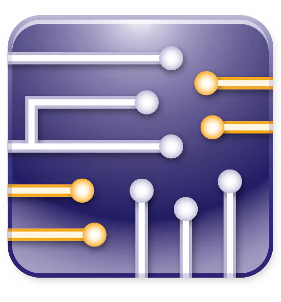
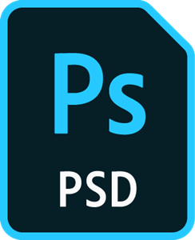

# Hi there, I'm Thimira Hirushan 👋

Welcome to my GitHub profile! I'm an enthusiastic third-year Electrical and Electronic Engineering undergraduate at the University of Peradeniya, Sri Lanka. I love tackling complex problems with logical and creative thinking, especially through programming, circuit designing, and machine learning.

## 🔧 Skills
- **Programming Languages:** Python, C, C++, AVR Assembly, Verilog HDL
- **Circuit Designing:** PCB designing, Soldering, Microcontroller Design (Arduino, ESP, Raspberry Pi)
- **Software Proficiency:** Altium, Eagle, Fusion360, AutoCAD, Proteus, Multisim
- **Problem-Solving:** Machine Learning, Data Structures and Algorithms

<code></code>
<code></code>
<code></code>
<code></code>
<code></code>
<code></code>
<code></code>
<code></code>
<code></code>
<code></code>
<code></code>
<code></code>
<code></code>
<code></code>
<code></code>
<code></code>
<code></code>
<code></code>

## 🎓 Education
- **BSc Engineering (Hons)** - Electrical and Electronic Engineering
  - University of Peradeniya, Sri Lanka (March 2021 - Present)

## 🚀 Projects
### NexCal: A Smart Calculator
- **Technologies:** Raspberry Pi Zero, PCB Design, Image Processing, Tkinter.
- **Contribution:** Designed firmware, circuit layouts, and PCBs.

### StringSync: An Automatic Guitar Tuner
- **Technologies:** Atmega328P Microcontroller, AVR Assembly, Signal Processing.
- **Contribution:** Designed and built circuits, developed hardware components, and optimized the code.

## 🏆 Competitions and Awards
- **IEEE SL Section Electronic Design Competition (EDC)** - 2nd Runners-up (2023)
- **SparkLink 1.0 Verilog Simulation Competition** - 2nd Runners-up (2023)
- **IEEE Xtreme 17.0** - Top 400 out of 6000+ teams (2023)
- **Coders V9.0** - 5th place (2022)
- **MoraXtreme 8.0** - Top 10 (2023)

## 📫 How to Reach Me
- **Email:** [thimirahirushan7@gmail.com](mailto:thimirahirushan7@gmail.com)
- **GitHub:** [ThimiH](https://github.com/ThimiH)
- **LinkedIn:** [Thimira Hirushan](https://www.linkedin.com/in/thimirah/)

Feel free to explore my repositories and get in touch if you'd like to collaborate on exciting projects!

---

### 📈 GitHub Stats

<!--
**ThimiH/ThimiH** is a ✨ _special_ ✨ repository because its `README.md` (this file) appears on your GitHub profile.

Here are some ideas to get you started:

- 🔭 I’m currently working on ...
- 🌱 I’m currently learning ...
- 👯 I’m looking to collaborate on ...
- 🤔 I’m looking for help with ...
- 💬 Ask me about ...
- 📫 How to reach me: ...
- 😄 Pronouns: ...
- ⚡ Fun fact: ...
-->
